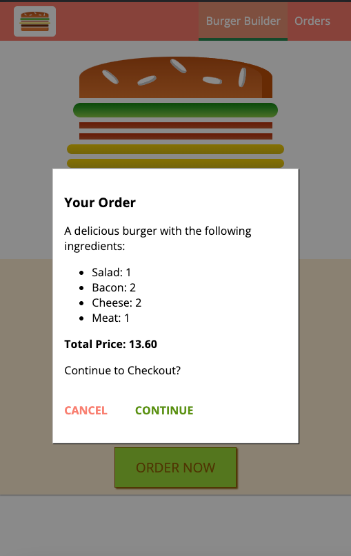
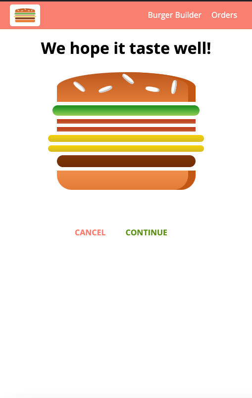
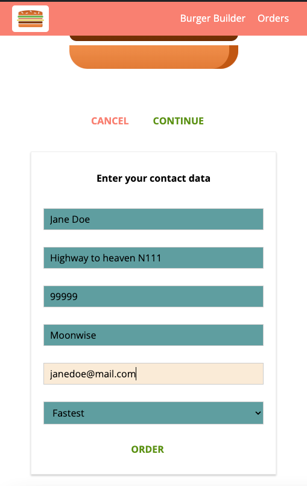

# react-burger-application
Simple application for building burger, add ingredients and then purchase it.

## In the project directory, you can run:

### `npm install`
### `npm start`

Runs the app in the development mode. 
Open [http://localhost:3007](http://localhost:3007) to view it in the browser.

The page will reload if you make edits. 
You will also see any lint errors in the console.

## Step by step building this app

### For REST API HTTP we will use Firebase - out of the box backend and DB

1. Open [https://console.firebase.google.com/u/0/]
2. Create project - this will configure up backend project which will automatically give you some REST API endpoints
and MongoDB database
3. After creation, go to Build/Realtime Database and create the DB
4. You will be given the endpoint to use, example: https://react-burger-http-app-default-rtdb.europe-west1.firebasedatabase.app/
5. We are not connecting to the DB directly, we are just sending HTTP req and firebase is doing all the mapping of HTTP
endpoints to the DB
6. In Rules tab, set read and write to true

### Install axios for setting HTTP requests

`npm install axios --save`

### Install routing package
`npm install --save react-router-dom@5.3.0`

### Install Redux for React for state management
`npm install --save redux react-redux`

## App UI Preview

### Order Summary Preview

### Mobile Sidedrawer

### Checkout Contact Data
